# numpy

## numpy的数组对象及索引

### 初始化

使用numpy下的函数array初始化列表为一个numpy的数组，该数组可以进行一些列简单的操作以及判断，数组中要求所有的原始是同一类型。

```python
import numpy as np
# 借助列表生成
a=np.array([1,2,3,4])
b=np.array([2,3,4,5])

print(np.zeros(5))# 生成全是0的数组，默认是浮点数
print(np.ones(5,dtype='int'))# 生成全都是1的数组，使用dtype可以指定数字类型

print(type(a))# <class 'numpy.ndarray'>

# 简单的加减乘除 
print(a+1)# [2 3 4 5]
print(a*2)# [2 4 6 8]
print(a>10)# 返回布尔值的数组

# 数组之间的加减	
print(a+b)# [3 5 7 9]

a.fill(5)# 将会填充所有值为5，如果传入的参数与原数字类型不同，会被自动转换
a=a.astype('float')# 可以转换数字类型，不会改变原数组需要重新赋值

a=arange(1,10)# 生成一个左闭右开的整数序列，可以传入第三个参数（步长）
a=np.linspace(1,10,5)# 生成一个等差数列，闭区间，第三个参数是等差数列包含多少个数字

a=np.random.rand(10)# 生成随机数0-1（不包括1），参数表示个数
a=np.random.randn(10)# 返回满足标准正态分布的随机数
a=np.random.randint(1,10,10)# 返回随机整数，给出范围和个数
```

### 数组的属性

a.dtype是数组中的元素的数据类型，a.shape返回行列的元组，a.size返回元素的个数

### 多维数组及其属性

```python 
# 使用列表构建二维数组
a=np.array([[1,2,3,4],[5,6,7,8]])

# 二维数组的索引与列表不同
a[1,3]# 使用逗号隔开，第一行第三列
a[1]# 返回一行的值
a[:3]# 返回前三行
a[:,1]# 返回一列的值，逗号用于分隔

# 二维数组支持切片操作
a[1,1:3]
a[2:,2:]
```

注意切片操作是涉及引用的，当把一个列表切片赋值给另一个列表之后，如果改变另一个列表的值，会影响到原列表。

```python
a=np.array([1,2,3,4])
b=a[1:3].copy() # 在赋值的同时使用函数copy()会申请新的内存，从而不影响原数组
```

花式索引需要指定索引位置：

```python 
index=[1,2,-3]
print(a[index])# 将会打印出三个位置的值

# 花式索引支持布尔值判定
mask=np.array([1,0,1,0,0,1],dtype=bool)# 设置数据类型不需要用字符串
a[mask,2]# 返回第二列与第一行第三行第六行相交的值
a[mask]# 返回一三六行

# 对于一个6x6的方阵如果想要取得次对角线上的值可以：
a[(0,1,2,3,4),(1,2,3,4,5)]# 使用具体的索引指定，分别给出具体的值
a[3:,(0,2,4)]# 返回最后三行的1，3，5列
```

花式索引返回的结果是复制而不是引用

### where语句

where语句会返回满足条件的值得索引

```python 
a=np.array([1,2,3,4,5,6])
np.where(a>5)# (array([5], dtype=int64),),返回元素位置
a[np.where(a>3)]# 可以得到相应的值
a[a>3]# 也可以
```

### 数组排序

```python 
np.sort(a)# 传入要排序的数组，会得到从小到大的顺序不会改变数组本身
np.argsort(a)# 返回的结果是按照从小到大顺序下的排列元素在原数组中的相对位置
```

### 相关数学操作

+ 求和：np.sum(array)
+ 最大值：np.max(array)
+ 最小值：np.min(array)
+ 均值：np.mean(array)
+ 标准差：np.std(array)
+ 绝对值：np.abs(array)
+ 指数：np.exp(array)
+ 协方差矩阵(计算相关性):np.cov(data1, data2)

### 多数数组操作

+ 数组形状：a.reshape(2,3)，返回一个两行三列的数组不改变原数组
+ 转置：a.T

### 数组连接

函数cnocatenate((a0,a1,a2...),axis=0)，数组需要使用元组包起来，默认axis=0拼接成为新的行，axis=1拼接成为新的列。

# PANDAS

## SERIES

要求所有的元素类型一致

一维的series可以用一维的列表初始化

```python
s=pd.series([1,3,5,np.nan,6,8])
# 打印s得到的结果是带有索引的，默认的索引都是数字，通过传入额外的参数自定索引
s=pd.series([1,3,5],index=['a','b','c'])
s.index=list('abcdef')# 或者直接赋值

s.index# 获取索引
s.values# 获取值
s[0]# 通过索引查找
s[2:5]# 支持切片操作，但是如果改变了索引就要传入新的索引区间，并且新的区间是全闭的
s[::2]# 间隔为2取数
s.index.name# 将给index赋值一个名称
```


## DataFrame

要求每一里的元素一致

构造时间序列

```python
date=pd.date_range('20180101',periods=6)
# DatetimeIndex(['2018-01-01', '2018-01-02', '2018-01-03', '2018-01-04','2018-01-05', '2018-01-06'],dtype='datetime64[ns]', freq='D')
```

使用二维数组创建DataFrame

```python
# 不指定索引
df=pd.DataFrame(np.random.randn(6,4))
```


```python
# 指定索引
date=pd.date_range('20180101',periods=6) 
df=pd.DataFrame(np.random.randn(6,4)，index=date,columns=list('ABCD')) 
```


### 查看基本数据

+ df.head()查看前几行，默认5行
+ df.tail() 查看后几行，默认是5
+ df.dtypes 得到每一列的数据类型
+ df['name'].dtype 获取一列的数据类型
+ df.index 得到下标
+ df.columns得到列标

## pandas读取数据及数据操作

pd.set_option('display.max_rows', None)
pd.set_option('display.max_columns', None)

用于显示全部的行和列

### 行操作

```python 
df.iloc[0]# 获取第一行
df.iloc[0:5]# 左闭右开的区间
df.iloc[0,0]# 获取其第一行第一列

df.loc[0:5]# 全闭的区间

# 添加一行
dict={'name':'nigga','data':'20230912','heat':121903,'type':comedy}
df=df._append(dict,ignore_index=True) # 覆盖原数据，ignore_index=True 参数确保新行的索引会自动递增。

# 删除一行
df=df.drop([index])# 传入要删除的行索引，参数inplace可以覆盖原始数据
df.drop(df[df['时长']>200].index,inplace=True)# 直接用条件语句判断得到的index

# 删除了数据之后，索引会不连续，可以重新对所索引赋值
df.index=range(len(df))
```

### 列操作

```python 
df[index][:5]# 访问列元素直接使用索引,可以配合切片操作只获取前几行
df[[index1,index2,index3]]# 获取多列

# 增加一列
df[index4]=...# 对不存在的列赋值会创建新的一列

# 删除一列
df=df.drop(列名,axis=1) 

# 删除15列及之后
df=df.iloc[:,:15]

# 删除所有unnamed列
data = data.loc[:, ~data.columns.str.contains('^Unnamed')]

# 写入
df.to_excel('movies_.xlsx')
```

### 通过标签选择数据

```python
df.loc[行名称，列名称]# 选取一行一列
df.loc[[1,3,5,7,9],['name','score']]# 选取多行多列
```

### 条件选择

```python
df['场地']=='美国'# 返回一系列布尔值
df[df['场地']=='美国']# 根据布尔值得出相应的结果

# 注意在筛选字符串的时候如下：
s=df[(df['上映地点'].str.strip()=='美国')]# 避免空字符串导致查询不到

# 如果其中包括多个国家，使用contains可以匹配到包含指定条件的行
s = df[(df['评分'] >= 9.2) & (df['上映地点'].str.contains('美国|墨西哥'))]


s=df[(df['总时长']<=30)&(df['干部时长']>=10)]# 多个条件筛选

# 使用|表示或
```

​	

### 缺失值以及异常值的处理

+ 判断缺失值：函数isnull()判断是由缺失df.isnull()会判断所有的数据，df['名称'].isnull()会判断一列

```python
print(df['短评'][-50:].isnull())# 如果没有缺失值结果中会只有索引
s=df[df['短评'].isnull()]# 筛选出没有短评的对象
```

+ 填充缺失值：	

```python
df['短评'].fillna('未知',inplace=True)# 直接对原始数据修改
df['评分']=df['评分'].fillna(np.mean(df['评分']))# 使用均值填充
data['入睡方式'].fillna(data['入睡方式'].median(), inplace=True)# 使用中位数填充
data['婴儿行为特征'].fillna(data['婴儿行为特征'].mode()[0], inplace=True)# mode寻找数值中的众数，[0]取第一个
```

+ 删除缺失值：

```python 
df.dropna()
# 参数 how='all'删除全为空值的行或列 inplace覆盖原数据
```

+ 异常值处理： 通过判断条件筛选出异常值，如果异常值较少可以删除

## 数据格式的转换

```python
df['投票人数']=df['投票人数'].astype('float')# 使用astype转换，注意重新赋值，参数是字符串

# 转换中如果存在异常值会报错	报错信息中会给出异常值的信息，再通过条件判断语句找出该行数据
df[df['年代']=='2008\u200e']['年代'].values# 可以得到具体的取值信息

df.loc[索引,'年代']=2008# 重新赋值

data['婴儿行为特征'] = data['婴儿行为特征'].astype('category').cat.codes# category用于表示有限数量的离散值或类别，.cat.codes获取每个类别的整数编码，这会将原始的类别值映射到整数编码

# 使用标签编码器对象不仅可以离散化数据，还可以还原数据
from sklearn.preprocessing import LabelEncoder as LE
le=LE()
df['婴儿行为特征']=le.fit_transform(df['婴儿行为特征'].astype(str))
...
a=le.inverse_transform(predict_res)# 将相应的结果传入即可
```

## 排序

```python 
df.sort_values(by='投票人数',inplace=True) # 按照给的参数排序，默认是升序
df.sort_values(by='投票人数',ascending=False,inplace=True)# 降序

# 多个值排序参数使用列表括起，列表中的顺序表示优先级
 df.sort_values(by=['评分','年份'],ascending=False,inplace=True)
```

## 基本统计分析

函数df.describe()可以进行描述性统计，通过描述性统计的结果（最大值最小值...）可以发现一些异常值

```python
df=pd.read_excel('movies.xlsx')
print(df.describe())

               投票人数           年份          评分
count  2.500000e+02   250.000000  250.000000
mean   7.605062e+05  2000.628000    8.932400
std    4.584339e+05    15.590957    0.268774
min    1.356680e+05  1931.000000    8.400000
25%    4.501418e+05  1994.000000    8.700000
50%    6.309525e+05  2004.000000    8.900000
75%    9.288780e+05  2011.000000    9.100000
max    2.919536e+06  2021.000000    9.700000
```

+ 最值：df['投票人数'].max()，df['投票人数'].min()
+ 均值和中值：df['投票人数'].mean()，df['投票人数'].median()
+ 方差和标准差：df['投票人数'].var()，df['投票人数'].std()
+ 求和：df['投票人数'].sum()
+ 相关系数和协方差：df[ ['投票人数','评分'] ].corr()，df[ ['投票人数','评分'] ].cov()
+ 计数：df['上映地点'].unique() 统计唯一值 df['年代'].value_counts()可以统计每一个唯一值出现的次数，比如统计每一年上映的电影数目，结果中自动进行降序排列

电影产出前五的国家和地区:df['产地'].value_counts()[:5]

## 数据替换

```python 
df['产地'].replace('USA','美国',inplace=True)# 第一个参数是被替换的值，第二个参数是用于替换的值
df['产地'].replace(['西德','苏联'],['德国','俄罗斯'],inplace=True)# 替换多个值使用列表，两二哥列表中的值一一对应
```

## 数据透视

```python 
pd.pivot_table(df,index=[])# 基础形式，第一参数是处理的文件，第二参数是索引，其中可以传多个值

# 你可以使用 fill_value 参数来指定在透视表中将缺失值（NaN）替换为特定的值。如果只有一个值的话aggfunc可以使用单个字符串
pivot_table = pd.pivot_table(df, index=['年份'], values=['投票人数'], aggfunc='sum', fill_value=0)


pivot_table = pd.pivot_table(df, index=['年份'], values=['投票人数', '评分'], aggfunc={'投票人数':np.sum, '评分': np.mean})# 对年份进行索引，然后对 '投票人数' 列进行求和，对 '评分' 列进行平均值计算。aggfunc设置为字典形式，一一对应

pivot_table = pd.pivot_table(df, index=['上映地点'], values=['投票人数', '评分'], aggfunc={'投票人数':np.sum, '评分': np.mean}
                           投票人数        评分
上映地点                                     
中国台湾 中国大陆 美国 中国香港        814786  8.700000
中国台湾 日本                  397740  9.100000
中国台湾 美国                  990709  9.100000
中国台湾                     765126  8.800000
中国大陆 中国香港               7747311  9.062500
...                         ...       ...
英国                      2025052  8.833333
西班牙                     1278596  8.800000
阿根廷 西班牙                  446378  8.800000
韩国                      7775186  8.950000
黎巴嫩 美国 法国 塞浦路斯 卡塔尔 英国   1051812  9.100000

# 在透视表中交换行和列
pivot_table = pivot_table.T
```

## 数据重塑和轴向旋转

### 层次化索引

设置两个索引，一个外层一个内层

#### Series 

```python
s=pd.Series(np.arange(1,10),index=[['a','a','a','b','b','c','c','d','d'],[1,2,3,1,2,3,1,2,3]])

a  1    1
   2    2
   3    3
b  1    4
   2    5
c  3    6
   1    7
d  2    8
   3    9
dtype: int32

print(s['a'])# 会打印外层索引为a的数据	
1    1
2    2
3    3
dtype: int32


print(s['a':'c'])# 切片操作
a  1    1
   2    2
   3    3
b  1    4
   2    5
c  3    6
   1    7
dtype: int32

print(s[:,1])# 对内层索引操作
a    1
b    4
c    7
dtype: int32

print(s['a',1])# 取出外层索引为a 内层索引为1的数据
```

通过unstack方法可以将一个series转化为DataFrame，反之使用stack()可以转回


```python
print(s.unstack())# 原本的外层变为行，内层变为列
   1    2    3
a  1.0  2.0  3.0
b  4.0  5.0  NaN
c  7.0  NaN  6.0
d  NaN  8.0  9.0
```

#### DataFrame

同样的设置两层

```python 
df=pd.DataFrame(np.arange(12).reshape(4,3),index=[['a','a','b','b'],[1,2,1,2]],columns=list('ABC'))
    A   B   C
a 1  0   1   2
  2  3   4   5
b 1  6   7   8
  2  9  10  11
    
df=pd.DataFrame(np.arange(12).reshape(4,3),index=[['a','a','b','b'],[1,2,1,2]],columns=[['A','A','B'],['Z','X','Y']])
print(df)

     A       B
     Z   X   Y
a 1  0   1   2
  2  3   4   5
b 1  6   7   8
  2  9  10  11

print(df['A'])

     Z   X
a 1  0   1
  2  3   4
b 1  6   7
  2  9  10
    
df=pd.DataFrame(np.arange(12).reshape(4,3),index=[['a','a','b','b'],[1,2,1,2]],columns=[['A','A','B'],['Z','X','Y']])
# 设置名称
df.index.names=['row1','row2']
df.columns.names=['col1','col2']
print(df)

col1       A       B
col2       Z   X   Y
row1 row2           
a    1     0   1   2
     2     3   4   5
b    1     6   7   8
     2     9  10  11
```

set_index()将列变为索引

```python 
df=df.set_index(['产地','年份'])# 以产地和年份作为索引，每一个索引都是一个元组

日本                     1988             龙猫  1275513        动画 奇幻 冒险  9.2   
美国                     2017          寻梦环游记  1696808     喜剧 动画 奇幻 音乐  9.1   
                       2010           怦然心动  1845763        剧情 喜剧 爱情  9.1   
中国大陆 中国香港              1994             活着   851438        剧情 历史 家庭  9.3   
美国 英国                  2008       蝙蝠侠：黑暗骑士  1068223  剧情 动作 科幻 犯罪 惊悚  9.2   
                       2001      哈利·波特与魔法石  1202777           奇幻 冒险  9.2  

print(df.loc['美国'])# 会得到以年代为索引的值
```

reset_index()取消层次化索引，不需要参数

## 离散化处理

离散化也称为分组化，区间化

```python 
pd.cut(df,bins(分组的依据),right=True(是否包括bins右端点),labels=None(定义区间),include_lowest=Flase(是否包括bins左端点))
a=pd.cut(df['评分'],[8.0,8.5,9.0,9.5,10.0],labels=['D','C','B','A'])# 按照评分划分，给出划分的依据以及标签(注意倒序)
df['评分']=a# 写入新的一列

# 根据热门人数划分，使用np.percentile()获取对应的百分比
bins=np.percentile(df["投票人数"],[0,20,40,60,80,100 ])
print(bins)
df['热门人数']=pd.cut(df['投票人数'],bins,labels=['E','D','C','B','A'])
print(df[:5])
```


# Matplotlib

## 引入

```python
import matplotlib.pyplot as plt # 导入，简写为plt
plt.style.use('bmh')# 设置绘图风格
...
plt.show() # 显示图像
```


## 创建实例

一个程序中可以有**多对figure和ax对象**，但是只能**有一对**当前活动的对象


Matplotlib有**两套**不同的接口，一个是**matlab风格的**(最初就是matlab用户提供的)，一个是**面向对象风格的** 。

+ 使用matlab风格的接口**调用当前活动的figure和ax对象**，如果不存在则会**自动创建**一个，可以通过**plt.gcf()和plt.gca()**获得当前图标的引用。

```python
plt.figure()  # 创建图表

# 创建子图
plt.subplot(2, 1, 1) # (行、列、子图表序号)
plt.plot(x, np.sin(x))
```

+ 使用面向对象风格的接口可以更灵活

```python
fig, ax = plt.subplots(2) # 生成一个Figure 对象，表示整个绘图画以及两个 Axes

# 在两个不同的Axes对象上调用plot方法分别作图
ax[0].plot(x, np.sin(x))
ax[1].plot(x, np.cos(x));
```


大多数`matlab`的接口，`面向对象都`可以直接使用，但也有一些例外

- `plt.xlabel()` → `ax.set_xlabel()`
- `plt.ylabel()` → `ax.set_ylabel()`
- `plt.xlim()` → `ax.set_xlim()`
- `plt.ylim()` → `ax.set_ylim()`
- `plt.title()` → `ax.set_title()`

可以一行内处理

```python
ax.set(xlim=(-5,15),ylim=(-2,2),title='sin(x)',xlabel='x', ylabel='sin(x)')
```


## 解决乱码和警告

```python
import warnings
warnings.filterwarnings("ignore")# 将忽略所有警告

plt.rcParams['font.sans-serif']=['SimHei']# 防止中文字体乱码
# 解决保存图像时负号'-'显示为方块的问题
plt.rcParams['axes.unicode_minus'] = False 
```


## 颜色

| **字符** | **颜色名称**          |
| -------- | --------------------- |
| `'b'`    | **blue**（蓝色）      |
| `'g'`    | **green**（绿色）     |
| `'r'`    | **red**（红色）       |
| `'c'`    | **cyan**（青色）      |
| `'m'`    | **magenta**（洋红色） |
| `'y'`    | **yellow**（黄色）    |
| `'k'`    | **black**（黑色）     |
| `'w'`    | **white**（白色）     |


## 颜色映射

| 名称     | 类型 | 说明                   |
| :------- | :--- | :--------------------- |
| viridis  | 连续 | 默认映射，易读、无失真 |
| plasma   | 连续 | 高对比度，明亮         |
| inferno  | 连续 | 黑色到黄色过渡         |
| magma    | 连续 | 深色到浅色             |
| cividis  | 连续 | 对色盲友好             |
| coolwarm | 发散 | 冷暖颜色映射           |
| RdBu     | 发散 | 红蓝对比               |
| gray     | 连续 | 黑白灰度               |
| jet      | 连续 | 传统但易失真，不推荐   |


## 折线图


### 基本使用

```python 
import matplotlib.pyplot as plt
plt.plot([1,2,3,4])# 如果只传入一个列表默认为Y，将会以y列表的索引为x轴

x=np.linspace(1,10,100)
plt.plot(x,np.sin(x)) # 设置x和y

ax.plot(x,np.cos(x)) # 同一幅图形中绘制多根线条，只需要多次调用
plt.show()
```

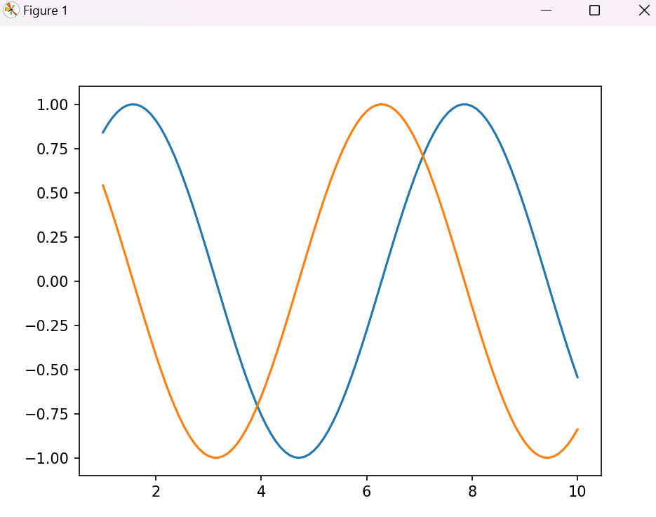


### 线条颜色

如果未指定颜色，则会默认使用一组颜色**循环**。

```python
plt.plot(x,np.sin(x-0),color='blue') # 指定颜色名称
plt.plot(x,np.sin(x-1),color='g') # 简写 
plt.plot(x,np.sin(x-2),color='0.74') # 灰度值
plt.plot(x,np.sin(x-1),color='#FFDD44') # 十六进制 
plt.plot(x, np.sin(x - 4), color=(1.0,0.2,0.3))# RGB三元组
```

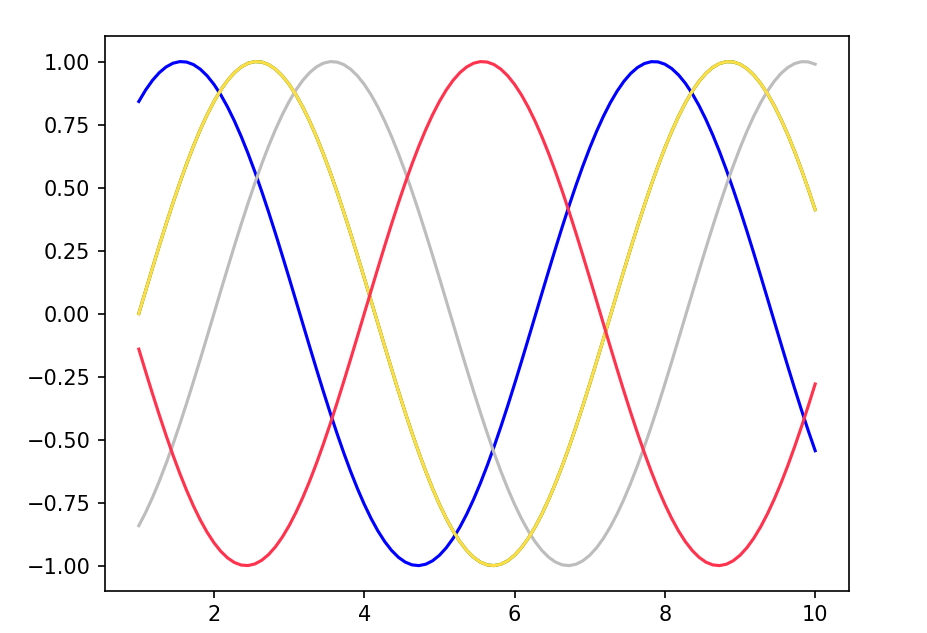

### 线条风格

```python
plt.plot(x, x + 0, linestyle='solid')# 实线  或者用-
plt.plot(x, x + 1, linestyle='dashed')# 虚线 或者用--
plt.plot(x, x + 2, linestyle='dashdot')# 点虚线 或者用-.
plt.plot(x, x + 3, linestyle='dotted')# 点线 或者用:
```

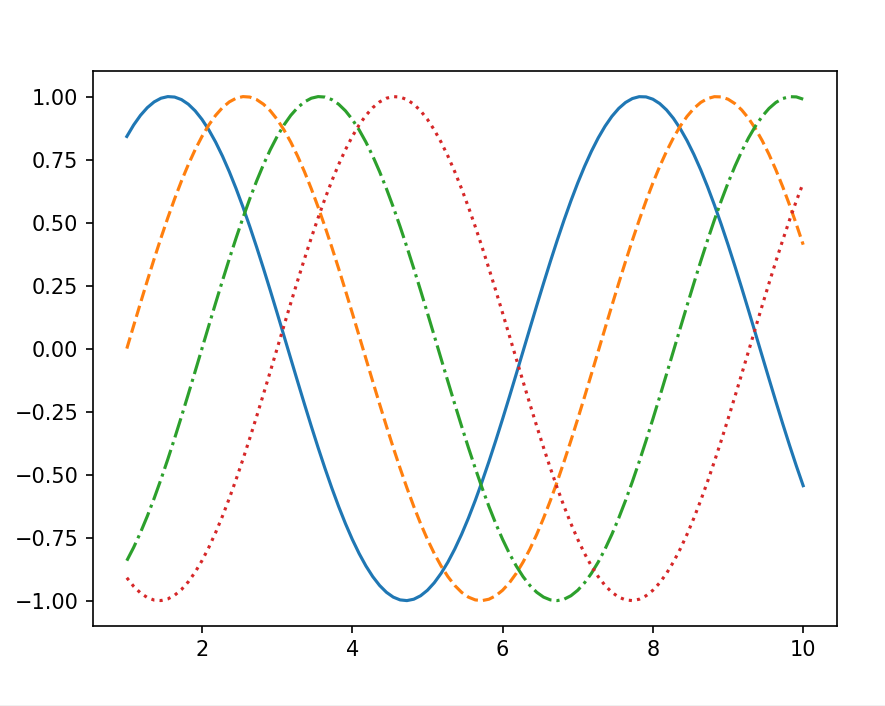

### 简写颜色与风格

```python
plt.plot(x,np.sin(x-0),'-b') 
plt.plot(x,np.sin(x-1),'--g') 
plt.plot(x,np.sin(x-2),'-.y') 
plt.plot(x,np.sin(x-3),'.r') 
```

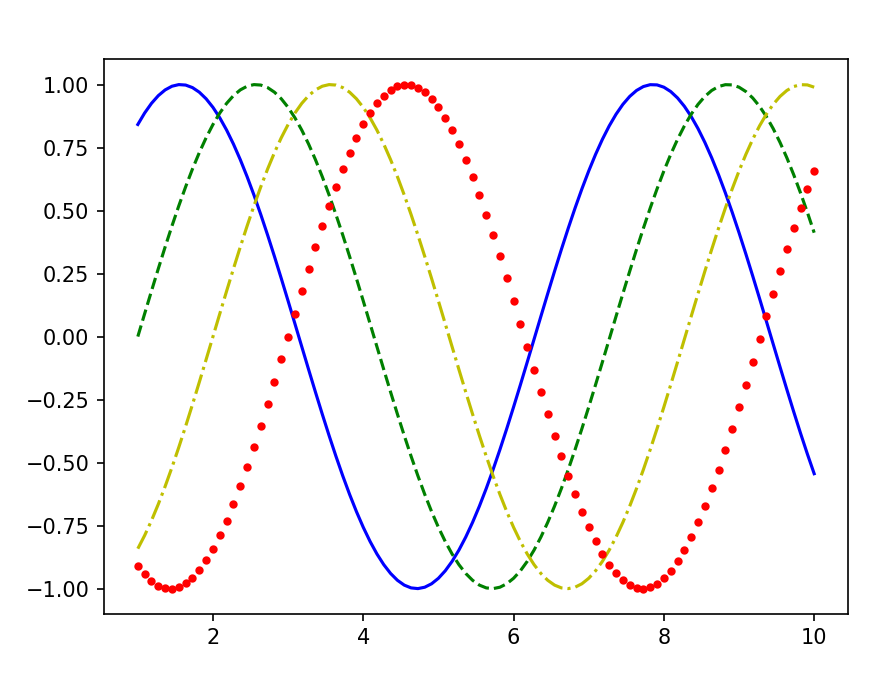

### 设置坐标轴

Matplotlib **自动**调整坐标轴范围，但也可以手动设置范围

```python
plt.xlim(-5,15)
plt.ylim(-2,2)

plt.axis([-5,15,-2,2])# 使用axis函数一次性设置
```

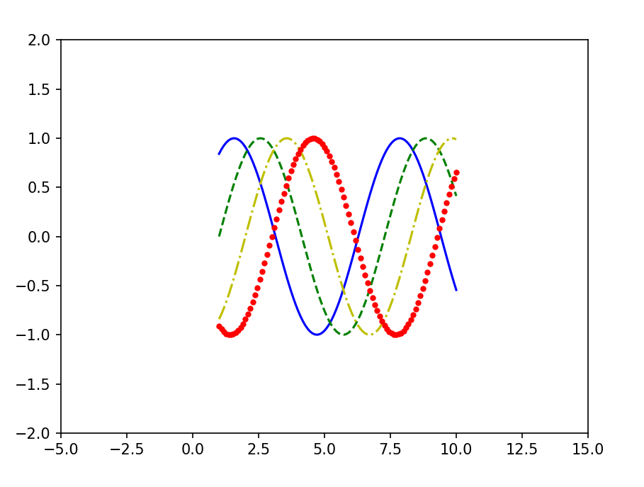

也能实现反向

```python
plt.xlim(15,-5)
plt.ylim(2,-2)
```

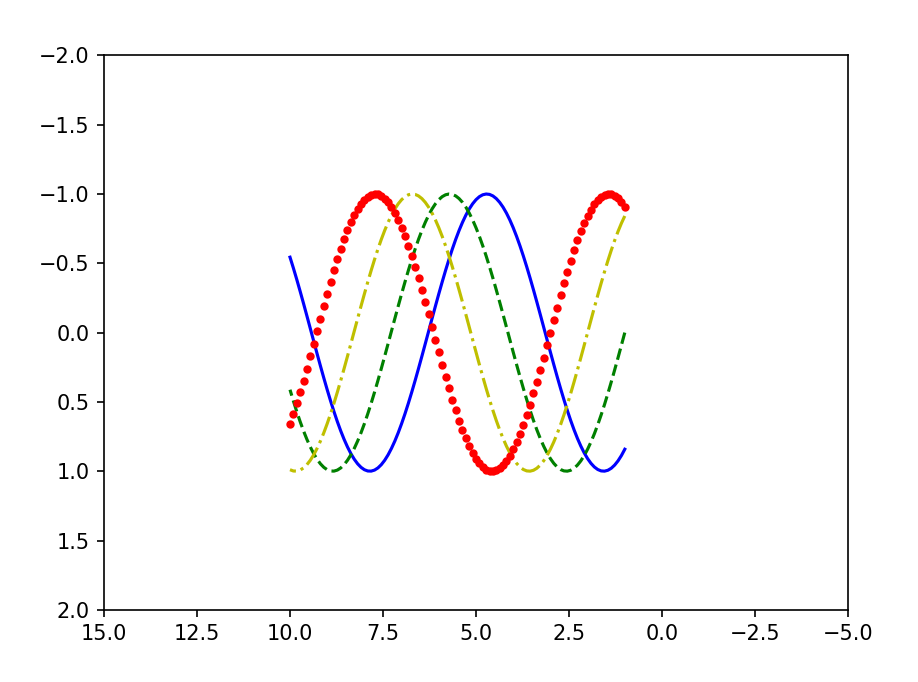

```python
plt.axis('tight')# 缩放坐标轴至刚刚好放下图像
```

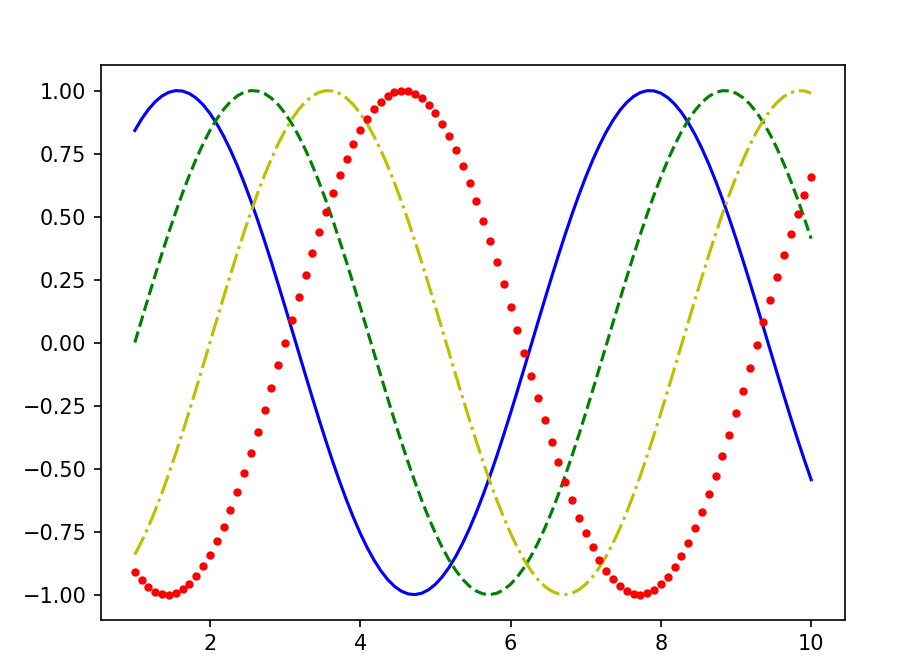


```python
plt.axis('equal')# x和y差不多大小
```


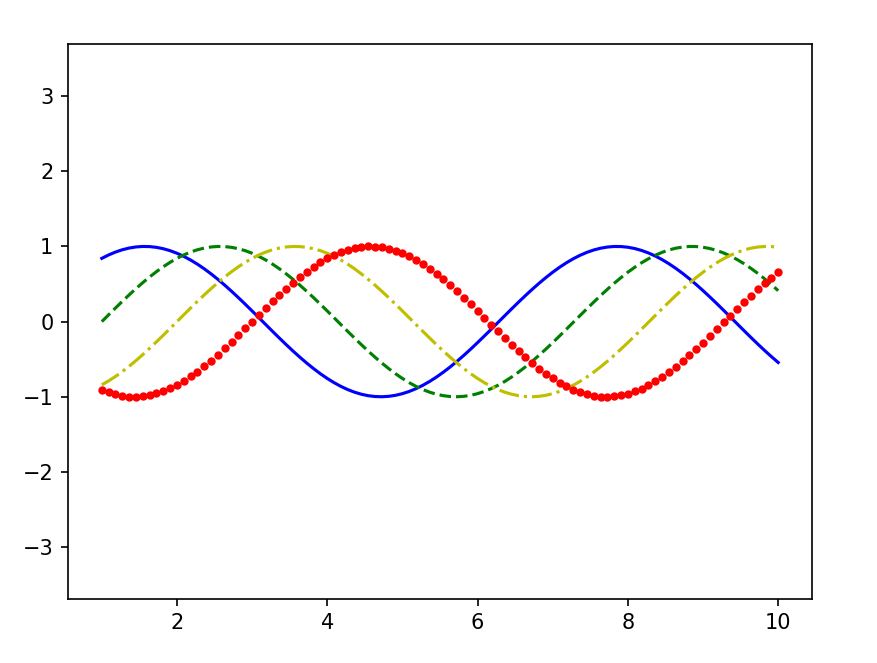


### 设置标签


```python
x=np.linspace(1,10,100)
plt.plot(x,np.sin(x),'--g',label='sin(x)') # label设置图例
plt.plot(x,np.cos(x),'-.r',label='cos(x)')
plt.legend() # 显示图例

plt.xlabel('横轴') # 横轴标签
plt.ylabel('纵轴') # 纵轴标签

plt.title('正弦与余弦') # 标题
```


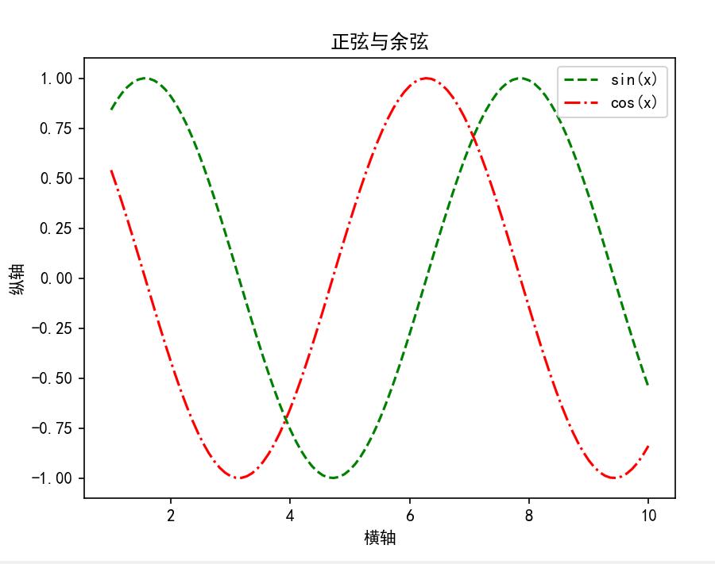

## 散点图

```python
ax.scatter(x,np.sin(x))
```


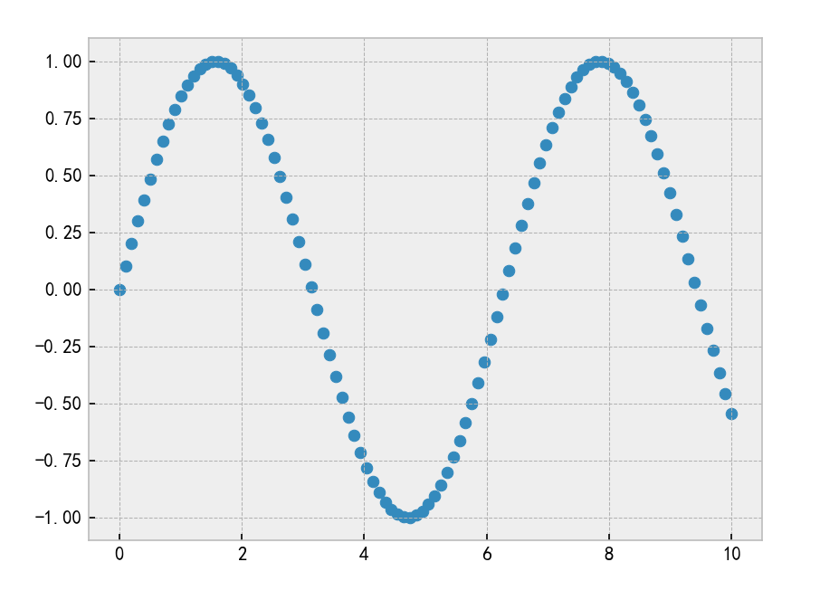


```python
import matplotlib.pyplot as plt
import numpy as np

# 数据
x = np.random.rand(50)
y = np.random.rand(50)
colors = np.random.rand(50)
sizes = np.random.rand(50) * 1000

# 散点图
plt.scatter(x, y, 
            s=sizes,          # 点的大小(面积) 可以传入数组或者数值
            c=colors,         # 点的颜色  简写c用于传入数值与camp做映射，如果要设置单一颜色则使用color
            cmap='viridis',   # 颜色映射表
            alpha=0.6,        # 透明度 
            edgecolors='black', # 边缘颜色 
            linewidths=1.5)    # 边缘线宽

plt.colorbar()  # 显示颜色条
plt.title('Scatter Plot Example')
plt.xlabel('X-axis')
plt.ylabel('Y-axis')
plt.show()
```


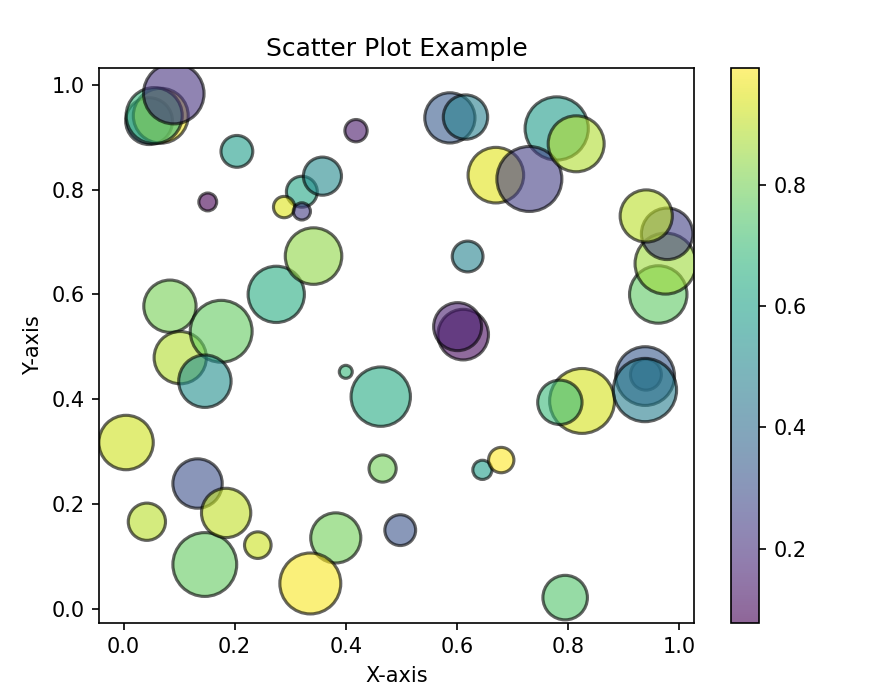

在数据过多的时候使用散点图的性能要**低于**折线图


## 误差可视化


## 饼图

```python
plt.pie(x, explode=None, labels=None, colors=None, autopct=None, shadow=False, startangle=0)
```

1. `x`：饼图的数据，通常是一个包含各个扇形部分大小的列表或数组。
2. `explode`：可选参数，用于突出显示某个或某些扇形部分。它是一个与 `x` 同样长度的列表，其中非零值表示相应扇形部分需要突出显示。非零值越大突出的部分越越远离主题
3. `labels`：可选参数，指定饼图中每个扇形部分的标签，通常是一个与 `x` 同样长度的列表或数组。
4. `colors`：可选参数，用于指定每个扇形部分的颜色，通常是一个与 `x` 同样长度的颜色列表。
5. `autopct`：可选参数，用于在每个扇形部分上显示百分比。通常是一个格式化字符串，例如 "%.1f%%"，用于显示一位小数的百分比。
6. `shadow`：可选参数，设置为 `True` 时在饼图下面添加阴影效果。
7. `startangle`：可选参数，用于指定饼图的起始角度，通常是一个浮点数，以度数表示。

## 频率分布直方图

直方图将数据分为多个等距区间，然后统计每个区间有多少个数据点落在其中。

```python
plt.hist(x, bins=None, range=None, density=False, cumulative=False, color=None, edgecolor=None, alpha=1, label=None)
```

1. `x`：直方图的数据，通常是一个包含待绘制数据的列表、数组或序列。
2. `bins`：可选参数，指定直方图的箱子（柱子）数量或区间。可以是一个整数，表示箱子数量，也可以是表示箱子边界的序列。默认为 `10`。
3. `range`：可选参数，用于指定直方图的数据范围，以元组 `(min, max)` 的形式传递。数据范围外的数据将被忽略。
4. `density`：可选参数，设置为 `True` 时，将绘制概率密度直方图，使直方图的面积等于 `1`。
5. `cumulative`：可选参数，设置为 `True` 时，将绘制累积直方图。
6. `color`：可选参数，用于指定直方图的颜色。
7. `edgecolor`：可选参数，用于指定直方图柱子边缘的颜色。
8. `alpha`：可选参数，指定柱子的透明度，取值范围为 `0` 到 `1`。
9. `label`：可选参数，用于指定直方图的标签，通常用于图例中。


## 双轴图

```python
import matplotlib.pyplot as plt
import numpy as np

# 创建示例数据
x = np.linspace(0, 10, 100)
y1 = np.sin(x)
y2 = np.cos(x)

# 创建第一个 Y 轴
fig, ax1 = plt.subplots()

# 绘制第一个 Y 轴的数据
ax1.plot(x, y1, 'g-')
ax1.set_xlabel('X 轴')
ax1.set_ylabel('Y1 轴', color='g')
ax1.tick_params('y', colors='g')

# 创建第二个 Y 轴，与第一个 Y 轴共享 X 轴
ax2 = ax1.twinx()

# 绘制第二个 Y 轴的数据
ax2.plot(x, y2, 'b-')
ax2.set_ylabel('Y2 轴', color='b')
ax2.tick_params('y', colors='b')

plt.title('双轴图示例')
plt.show()
```


### 绘制热图

热图是在一个矩形网格通过颜色表示数据的相对大小或值。

```python
import seaborn as sns
import numpy as np
import matplotlib.pyplot as plt

# 创建一个示例矩阵
data = np.random.rand(5, 5)  # 5x5 随机数据矩阵

# 绘制热图
sns.heatmap(data, cmap='coolwarm', annot=True)  #camp颜色映射 annot=True 显示数值标签 fmt数值格式'.2f'表示保留两位小数
plt.title('Heatmap Example')
plt.show()
```


# 实例：处理附件

```python
import matplotlib.pyplot as plt
import seaborn as sns
import numpy as np
import pandas as pd

# 设置字体与负号显示问题
plt.rcParams['font.sans-serif']=['SimHei']
plt.rcParams['axes.unicode_minus']=False

# 读取附件
df=pd.read_excel('附件.xlsx')

# 转换函数
def time_to_minute(time):
    parts=time.split(':')
    hour=int(parts[0])
    min=int(parts[1])
    second=int(parts[2])

    total_time=hour*60+min+(second/60)
    return total_time

# 删除所有的Unamed列
df=df.loc[:,~df.columns.str.contains('^Unnamed')]

# 删除时间中的异常值
df.drop(df[df['整晚睡眠时间（时：分：秒）']=='99:99'].index,inplace=True)

# 填充缺失值
df['整晚睡眠时间（时：分：秒）'].fillna(df['整晚睡眠时间（时：分：秒）'].mode()[0],inplace=True)
df['睡醒次数'].fillna(df['睡醒次数'].median(),inplace=True)
df['入睡方式'].fillna(df['入睡方式'].median(),inplace=True)
df['婴儿行为特征'].fillna(df['婴儿行为特征'].mode()[0],inplace=True)

# 将时间一列转换为字符串
df['整晚睡眠时间（时：分：秒）'] = df['整晚睡眠时间（时：分：秒）'].astype(str)

# 转换为分钟数
df['整晚睡眠时间（时：分：秒）']=[time_to_minute(time) for time in df['整晚睡眠时间（时：分：秒）'] ]

# 将婴儿的行为特征离散化
df['婴儿行为特征']=df['婴儿行为特征'].astype('category').cat.codes

# 计算斯皮尔曼系数
corr=df.drop('编号',axis=1).corr(method='spearman')

print(df.head())

# 设置掩码，因为计算出的斯皮尔曼系数是对称的，np.ons_like()根据corr构造一个同规模的矩阵，然后设置类型为布尔值，np.triu取得上三角
mask=np.triu(np.ones_like(corr,dtype=bool))

plt.figure(figsize=(16,10))

# 画热图，cbar_kws设置颜色条为一半
sns.heatmap(corr,mask=mask,cmap='viridis',annot=True,fmt='.2f',linewidths=0.5,cbar_kws={'shrink':.5})

# 旋转横坐标
plt.xticks(rotation=45,ha='right')

plt.title('斯皮尔曼系数')

plt.show()
```

​	

​	
